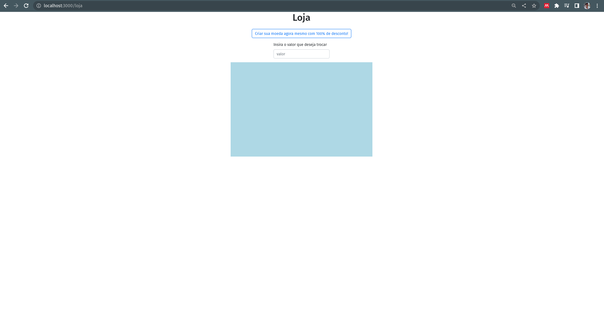
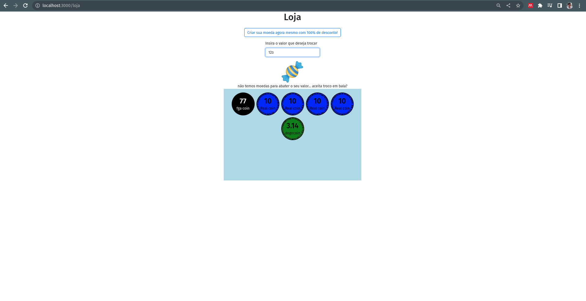
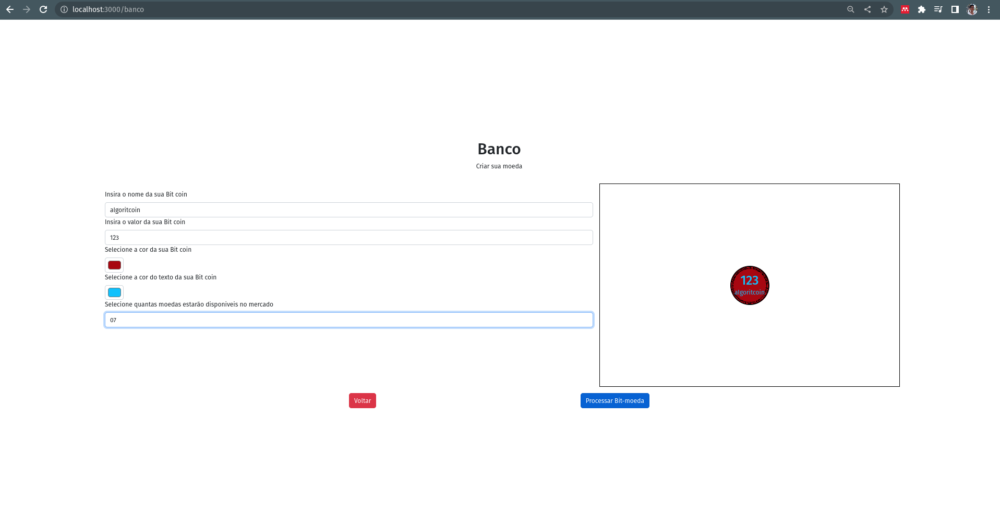
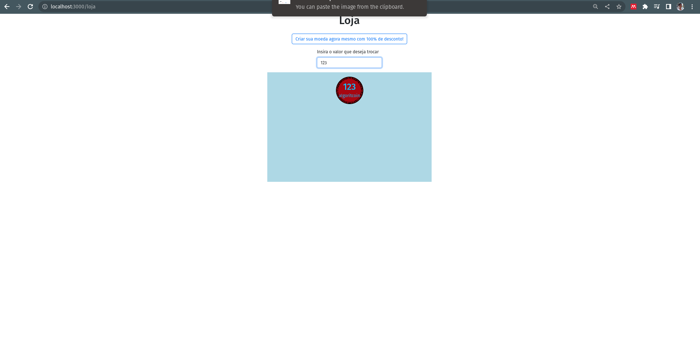

Temas:
 - Coins changing

# Greed Bit Trader

**Número da Lista**: 25 
**Conteúdo da Disciplina**: Greed 

## Alunos
|Matrícula | Aluno |
| -- | -- |
| 18/0068229  |  Victor Yukio Cavalcanti Miki |
| 18/0016067  |  Erick levy Barbosa Dos Santos|

## Sobre 
Fizemos uma aplicação Web em react que simula a criação de moedas e poder fazer compras recebendo o troco nas bit moedas criadas!  

## Screenshots

## Instalação 
**Linguagem**: javascript 
**Framework**: React 
### Pré-requisitos

Para rodar a aplicação é nescessário instalar:

* NodeJs >= 14.0
* npm >= 5.6

| nota: "npx" é uma ferramenta executor e já vem incluso com a instalação no npm.

Você pode instalar o nodeJs via nvm que já gerencia a versão que você está usando.

## Uso 

Para rodar o projeto siga o passo-a-passo:

1. Clone o repositório:

| $ git clone https://github.com/projeto-de-algoritmos/Greed_BitTrader.git

2. acesse a pasta "app":

| $ cd app

3. instale aos pacotes necessários via npm:

| $ npm install

4. rode o programa com o comando:

| npm start

Uma página deverá abrir automáticamente no seu navegador pelo endereço: http://localhost:3000/. Crie sua moedas e faça trocas na nossa loja de escâmbio online.

